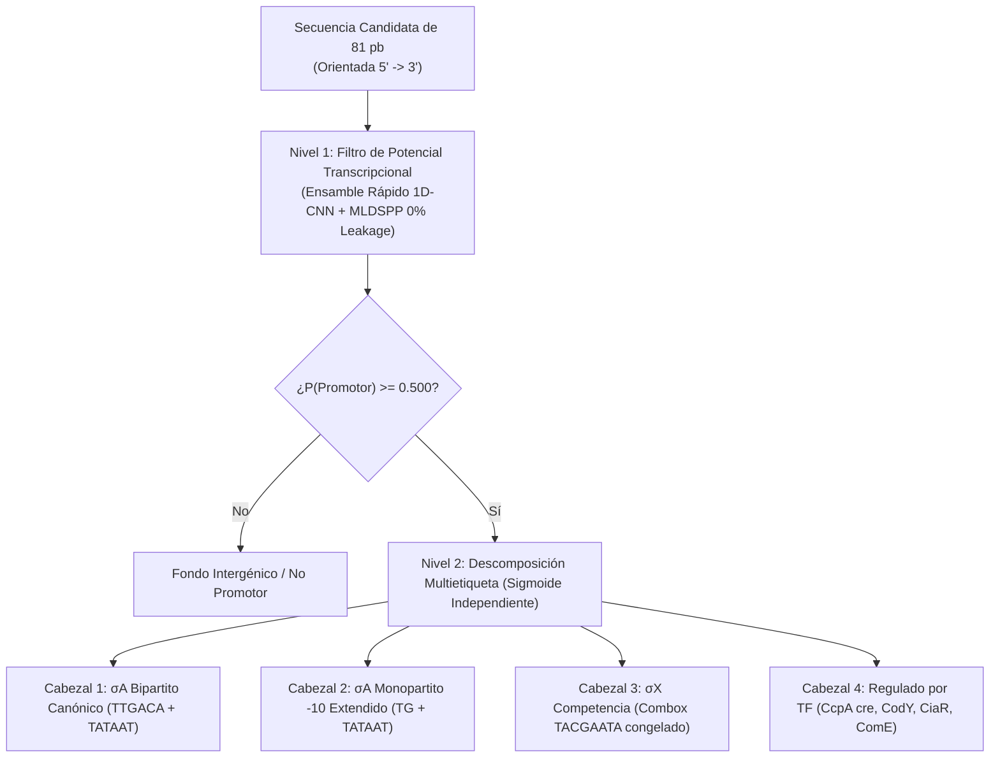

# MARCO TEÓRICO Y PROPUESTA ARQUITECTÓNICA: GRAMÁTICA MODULAR Y CLASIFICACIÓN JERÁRQUICA MULTICLASE DE PROMOTORES EN *STREPTOCOCCUS PNEUMONIAE*

**Autores:** Consejo Asesor de Bioinformática & Pipeline promoter-tools  
**Fecha:** 26 de Agosto de 2026  
**Estatus:** Propuesta de Investigación y Diseño Computacional  

---

## 1. Justificación y Planteamiento del Problema

El paradigma clásico de anotación de promotores bacterianos asume una estructura rígida bipartita:
$$\text{Promotor} \sim \text{Caja } -35 \text{ (TTGACA)} + \text{Espaciador (16--18 pb)} + \text{Caja } -10 \text{ (TATAAT)} + \text{Iniciador } +1$$

Sin embargo, los datos empíricos obtenidos en el transcriptoma experimental de *Streptococcus pneumoniae* D39V ($N=988\text{ TSSs}$) demuestran que este modelo sólo describe al **$31,1\%$** de los promotores conservados:
1. **$36,9\%$ ($N=261$)** son promotores monopartitos dependientes de **$-10$ extendido (`TRTGNT`)**, donde la caja $-35$ es completamente dispensable.
2. **$2,1\%$ ($N=21$)** son promotores específicos de competencia **$\sigma^X$ (Combox `TACGAATA`)**.
3. **$19,4\%$ ($N=137$)** son promotores regulados por **Factores de Transcripción (TFs)** como CcpA, CodY, CiaR, Spx, RitR y ComE, que reclutan activamente a la ARN polimerasa ($\text{E}\sigma^A$) en sitios con secuencias basales divergentes.
4. **$10,5\%$ ($N=74$)** presentan divergencia puntual en cajas $-35$ o $-10$, compensada por estabilidad térmica local.

Un clasificador binario estándar (Promotor vs. No Promotor) que no considere esta heterogeneidad genera falsos negativos en promotores dependientes de $-10$ extendido y carece de interpretabilidad funcional.

---

## 2. Marco Teórico 1: Gramática Modular Posicional (*Modular Positional Grammar*)

Se propone desacoplar la secuencia de 81 pb en módulos funcionales biológicos independientes con reglas de compensación biofísica:

```
Coordenadas Relativas al TSS (+1):
[-60 --------- -35 --------- -15 -14 ----- -10 ---- -4 ---- +1 ---- +15]
     |              |            |           |         |       |       |
  Operador TF   Caja -35      Ext-10      Pribnow    Fusión   TSS   Operador Represor
 (cre/CodY/etc) (TTGACA)       (TG)       (TATAAT)  (Melting) (A/G)  (Downstream cre)
```

### Formalización Matemática Diferenciable ($\text{Log-Sum-Exp}$ Soft Gating):
Para evitar el colapso de gradientes del operador $\max$ rígido y permitir optimización por descenso de gradiente (Adam), la afinidad transcripcional $\mathcal{S}_{\tau}(\mathbf{x})$ se formula mediante una aproximación suave estrictamente convexa con temperatura biofísica $\tau > 0$:

$$\mathcal{S}_{\tau}(\mathbf{x}) = \tau \ln \sum_{k=1}^{K} \exp\left( \frac{\mathcal{S}_k(\mathbf{x})}{\tau} \right)$$

Las rutas funcionales $\mathcal{S}_k(\mathbf{x})$ se definen como:
1. **Ruta Bipartita $\sigma^A$:** $\mathcal{S}_1(\mathbf{x}) = w_1 \cdot \mathcal{M}_{-35}(\mathbf{x}_{[-38:-30]}) + w_2 \cdot \mathcal{M}_{-10}(\mathbf{x}_{[-14:-6]}) + \mathcal{P}_{\text{spacer}}(\Delta d)$
   - $\mathcal{P}_{\text{spacer}}(\Delta d) = -\lambda_1 (\Delta d)^2 - \lambda_2 \cdot \mathbb{I}(\Delta d < 0) \cdot |\Delta d|$ modela el potencial asimétrico de la doble hélice B-DNA ($10,5\text{ pb/vuelta}$).
2. **Ruta Monopartita con $-10$ Extendido $\sigma^A$:** $\mathcal{S}_2(\mathbf{x}) = w_3 \cdot \mathcal{M}_{\text{joint}}(\mathbf{x}_{[-17:-6]})$
   - Evalúa conjuntamente el dinucleótido `TG` ($-15/-14$) y el hexámero Pribnow para evitar colinealidad.
3. **Ruta Alternativa $\sigma^X$ (ComX):** $\mathcal{S}_3(\mathbf{x}) = \alpha_C \cdot \mathcal{M}_{\text{PWM\_combox}}(\mathbf{x}_{[-15:-5]}) + b_C$
   - Módulo regularizado con matriz de pesos posicionales (PWM) congelada para evitar sobreajuste en el soporte reducido ($N=21$).
4. **Ruta Reclutada por Factores de Transcripción (TFs):** $\mathcal{S}_4(\mathbf{x}) = w_4 \cdot \mathcal{M}_{\text{TF}}(\mathbf{x}_{[-60:+15]}) + w_5 \cdot \mathcal{M}_{\text{basal}}(\mathbf{x}_{[-14:-6]})$
   - Ventana dinámica $[-60, +15]$ que captura operadores río arriba (ComE, CodY) y represores solapantes con el TSS (cajas *cre* de CcpA).

---

## 3. Marco Teórico 2: Paisaje Termodinámico y Deformabilidad del ADN

En bacterias de bajo contenido GC ($40\%\text{ GC}$, $60\%\text{ AT}$), la apertura de la burbuja de transcripción (isomerización $\text{RP}_c \to \text{RP}_o$) se modela incorporando un tensor de propiedades biofísicas locales de 5 canales:
1. **Energía Libre de Desapilamiento ($\Delta G_{37}^{\circ}$):** Parámetros de SantaLucia (1998) en la región de fusión ($-11$ a $-4$).
2. **Entalpía ($\Delta H^{\circ}$) y Entropía ($\Delta S^{\circ}$):** Estabilidad del dúplex de ADN.
3. **Propeller Twist y Deformabilidad (*DNA Bendability*):** Facilidad de curvatura inducida por tractos ricos en A/T para el enrollamiento de la ARN polimerasa ($\alpha$-CTD).

---

## 4. Arquitectura Jerárquica Multietiqueta (Multi-Label) en 2 Niveles



### Justificación de la Descomposición Multietiqueta:
A diferencia de un Softmax mutuamente excluyente, los cabezales sigmoides independientes reflejan la realidad biológica: un promotor $\sigma^A$ o $\sigma^X$ puede co-ocurrir simultáneamente con un sitio de unión de un factor de transcripción represor o activador.

---

## 5. Estrategia de Validación y Prevención de Fugas de Información

1. **Validación Cruzada Pangenómica sin Fugas (*Cluster-Aware GroupKFold*):** Partición estricta basada en los $2.247$ clústeres MMseqs2 para garantizar que secuencias homólogas entre D39V y TIGR4 permanezcan juntas en entrenamiento o prueba.
2. **Test de Permutación Preservando Dinucleótidos (Markov 1er Orden):** Validación estadística del módulo TF mediante permutaciones de Altschul-Erickson ($B=1.000$ réplicas) para confirmar ganancia biológica sobre ruido de composición.
3. **Mutagénesis de Saturación *In Silico* (ISM):** Comprobación de que mutaciones en `TG` $(-15/-14)$ o `TACGAATA` $(-10)$ colapsen selectivamente las probabilidades de los cabezales correspondientes.

