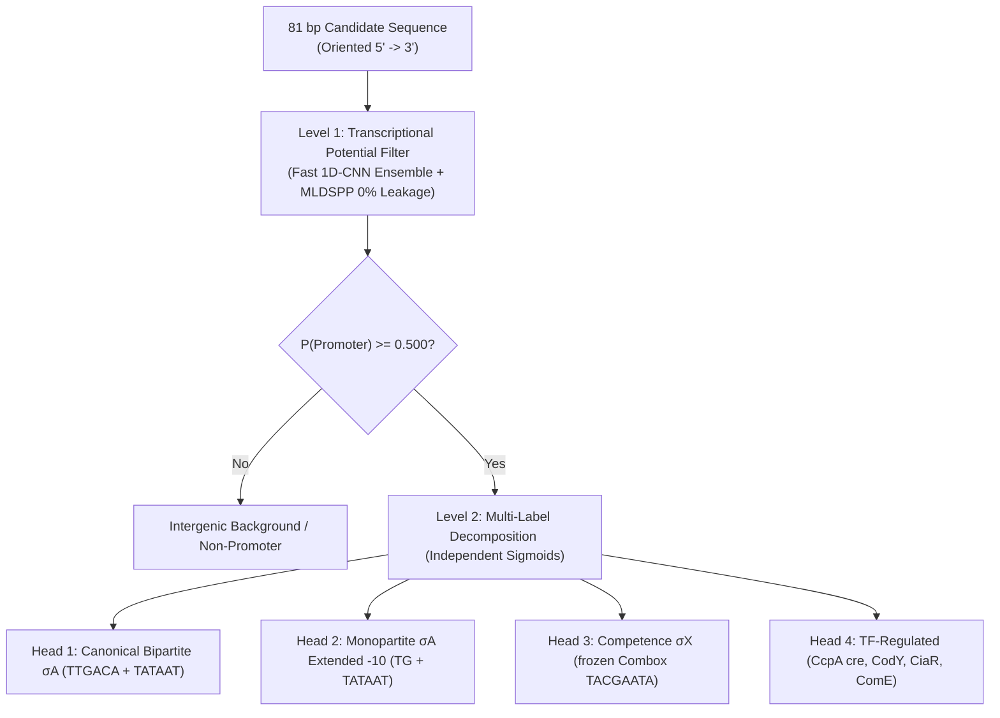

# THEORETICAL FRAMEWORK AND ARCHITECTURAL PROPOSAL: MODULAR GRAMMAR AND HIERARCHICAL MULTICLASS CLASSIFICATION OF PROMOTERS IN *STREPTOCOCCUS PNEUMONIAE*

**Authors:** Bioinformatics Advisory Council & promoter-tools pipeline
**Date:** August 26, 2026
**Status:** Research and Computational Design Proposal

---

## 1. Motivation and Problem Statement

The classical paradigm of bacterial promoter annotation assumes a rigid bipartite structure:
$$\text{Promoter} \sim \text{-35 box (TTGACA)} + \text{Spacer (16--18 bp)} + \text{-10 box (TATAAT)} + \text{Initiator } +1$$

However, empirical data from the experimental transcriptome of *Streptococcus pneumoniae* D39V ($N=988\text{ TSSs}$) show that this model describes only **$31.1\%$** of conserved promoters:
1. **$36.9\%$ ($N=261$)** are monopartite promoters dependent on an **extended $-10$ (`TRTGNT`)**, where the $-35$ box is fully dispensable.
2. **$2.1\%$ ($N=21$)** are competence-specific **$\sigma^X$ promoters (Combox `TACGAATA`)**.
3. **$19.4\%$ ($N=137$)** are promoters regulated by **Transcription Factors (TFs)** such as CcpA, CodY, CiaR, Spx, RitR and ComE, which actively recruit RNA polymerase ($\text{E}\sigma^A$) at sites with divergent basal sequences.
4. **$10.5\%$ ($N=74$)** show point divergence in $-35$ or $-10$ boxes, compensated by local thermal stability.

A standard binary classifier (Promoter vs. Non-Promoter) that ignores this heterogeneity produces false negatives on extended-$-10$ promoters and lacks functional interpretability.

---

## 2. Theoretical Framework 1: Modular Positional Grammar

We propose decoupling the 81 bp sequence into independent biological functional modules with biophysical compensation rules:

```
Coordinates relative to TSS (+1):
[-60 --------- -35 --------- -15 -14 ----- -10 ---- -4 ---- +1 ---- +15]
     |              |            |           |         |       |       |
  TF operator   -35 box      Ext-10      Pribnow    Melting   TSS   Repressor operator
 (cre/CodY/etc) (TTGACA)       (TG)       (TATAAT)  (Fusion)  (A/G)  (Downstream cre)
```

### Differentiable Mathematical Formalization ($\text{Log-Sum-Exp}$ Soft Gating):
To avoid the gradient collapse of the rigid $\max$ operator and allow optimization by gradient descent (Adam), transcriptional affinity $\mathcal{S}_{\tau}(\mathbf{x})$ is formulated via a strictly convex smooth approximation with biophysical temperature $\tau > 0$:

$$\mathcal{S}_{\tau}(\mathbf{x}) = \tau \ln \sum_{k=1}^{K} \exp\left( \frac{\mathcal{S}_k(\mathbf{x})}{\tau} \right)$$

The functional routes $\mathcal{S}_k(\mathbf{x})$ are defined as:
1. **Bipartite $\sigma^A$ route:** $\mathcal{S}_1(\mathbf{x}) = w_1 \cdot \mathcal{M}_{-35}(\mathbf{x}_{[-38:-30]}) + w_2 \cdot \mathcal{M}_{-10}(\mathbf{x}_{[-14:-6]}) + \mathcal{P}_{\text{spacer}}(\Delta d)$
   - $\mathcal{P}_{\text{spacer}}(\Delta d) = -\lambda_1 (\Delta d)^2 - \lambda_2 \cdot \mathbb{I}(\Delta d < 0) \cdot |\Delta d|$ models the asymmetric potential of B-DNA ($10.5\text{ bp/turn}$).
2. **Monopartite route with extended $-10$ $\sigma^A$:** $\mathcal{S}_2(\mathbf{x}) = w_3 \cdot \mathcal{M}_{\text{joint}}(\mathbf{x}_{[-17:-6]})$
   - Jointly evaluates the `TG` dinucleotide ($-15/-14$) and the Pribnow hexamer to avoid collinearity.
3. **Alternative $\sigma^X$ route (ComX):** $\mathcal{S}_3(\mathbf{x}) = \alpha_C \cdot \mathcal{M}_{\text{PWM\_combox}}(\mathbf{x}_{[-15:-5]}) + b_C$
   - Module regularized with a frozen positional weight matrix (PWM) to avoid overfitting on the reduced support ($N=21$).
4. **TF-recruited route:** $\mathcal{S}_4(\mathbf{x}) = w_4 \cdot \mathcal{M}_{\text{TF}}(\mathbf{x}_{[-60:+15]}) + w_5 \cdot \mathcal{M}_{\text{basal}}(\mathbf{x}_{[-14:-6]})$
   - Dynamic window $[-60, +15]$ capturing upstream operators (ComE, CodY) and repressors overlapping the TSS (CcpA *cre* boxes).

---

## 3. Theoretical Framework 2: Thermodynamic Landscape and DNA Deformability

In low-GC bacteria ($40\%\text{ GC}$, $60\%\text{ AT}$), opening of the transcription bubble (isomerization $\text{RP}_c \to \text{RP}_o$) is modeled by incorporating a 5-channel local biophysical property tensor:
1. **Stacking Free Energy ($\Delta G_{37}^{\circ}$):** SantaLucia (1998) parameters in the melting region ($-11$ to $-4$).
2. **Enthalpy ($\Delta H^{\circ}$) and Entropy ($\Delta S^{\circ}$):** DNA duplex stability.
3. **Propeller Twist and DNA Bendability:** Ease of curvature induced by A/T-rich tracts for RNA polymerase ($\alpha$-CTD) wrapping.

---

## 4. Two-Level Hierarchical Multi-Label Architecture



### Justification of the Multi-Label Decomposition:
Unlike a mutually exclusive Softmax, independent sigmoid heads reflect biological reality: a $\sigma^A$ or $\sigma^X$ promoter can co-occur simultaneously with a repressor or activator transcription factor binding site.

---

## 5. Validation Strategy and Data-Leakage Prevention

1. **Leakage-Free Pangenomic Cross-Validation (Cluster-Aware GroupKFold):** Strict partitioning based on the 2,247 MMseqs2 clusters to guarantee that homologous sequences between D39V and TIGR4 stay together in train or test.
2. **Dinucleotide-Preserving Permutation Test (1st-Order Markov):** Statistical validation of the TF module via Altschul-Erickson permutations ($B=1{,}000$ replicates) to confirm biological gain over composition noise.
3. *In Silico* Saturation Mutagenesis (ISM): Verification that mutations in `TG` ($-15/-14$) or `TACGAATA` ($-10$) selectively collapse the probabilities of the corresponding heads.
